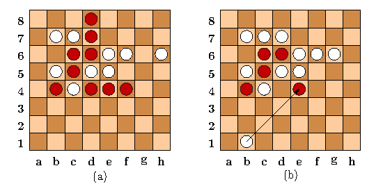

# Lines Of Action
An implementation of a version of the board game Lines of Action (LOA) invented by Claude Soucie.

## Table of Contents
* [Contents](#contents)
* [How To Play](#how-to-play)
    * [Notation](#notation)
    * [Rules](#rules)
    * [Example](#example)
    * [Controlling Play](#controlling-play)
* [Running the Application](#running-the-application)
    * [On Terminal](#running-on-terminal)
    * [Using GUI](#running-it-using-gui)

## Contents

Java Class | Description
----- | -----
`Piece.java` | An enumeration type describing the kinds of pieces.
`Board.java` | Represents a game board.  Contains much of the machinery for checking or generating possible moves.
`Square.java` | Represents a position on a Board.
`Move.java` | Represents a single move.
`Game.java ` | Controls play of the game.  Calls on Players to provide moves, executes other commands, and maintains a current Board.
`Player.java` | Supertype representing common characteristics of players.
`HumanPlayer.java` | A kind of Player that reads moves from the standard input (i.e., presumably from a human player).
`MachinePlayer.java` | A kind of Player that chooses its moves automatically.
`Reporter.java` | The supertype of "reporters", which announce errors, moves, and other notes to the user.
`TextReporter.java` | A type of Reporter that uses the standard output (generally the terminal) for output.
`View.java` | An interface for things that display the Board on each move.
`NullView.java` | A View that does nothing.
`Utils.java ` | Assorted utility functions for debugging messages and error reporting.
`UnitTests.java ` | Class that coordinates unit testing of the loa package.
`BoardTest.java` | Class containing unit tests of the Board class.

The following are relevant to the extra-credit portion:

Java Class | Description
---------- | -------------
`GUI.java` | A class that represents a graphical user interface (GUI) for the Loa game.
`BoardWidget.java` | Used by the GUI class to display the board.
`GUIPlayer.java` | A type of manual Player that takes move from the GUI.

 ## How To Play
#### Notation
* Columns are denoted with letters a-h from left
* Rows are denoted with numbers 1-8 from bottom

#### Rules
 * You can move one checker in one direction at a time, vertically, horizontally, or diagonally. 
 * The total number of checkers (including your opponents) in that column (aka file), row (aka rank), or diagonal path determines how many spaces that checker must move, if moved. 
 * Your checkers can jump over your own checkers, but cannot land on your checkers. 
 * Your checkers can land on your opponent’s checkers, but cannot jump over your opponent’s checkers. 
 * Landing on your opponent’s checker, removes that checker from the game. 
 * Black moves first. 
 * The winner is the first player to connect all of their checkers still on the board. 
    * In the event that one move results in a connection for both players, the game traditionally results in a draw. 
    * Additionally, when a player has only one remaining checker on the board, that player wins, as one checker is considered a continuous line.
    
#### Example

* (a) Initial Position
* (b) Possible moves for the black piece at f3. 
    * In (b) the piece at f3 cannot move horizontally to the right because it would be forced to move 4 steps, which would push it off the board. 
    * The same piece cannot move vertically up because there are 4 pieces in the vertical line of action and moving 4 steps up would require it to move over enemy pieces
 

* End positions. 
* Position (a) is a win for Black. 
* In position (b), White can move as shown, capturing an isolated black piece and giving both players contiguous pieces. Since it is White's move, however, the result is counted as a winning position for White.

 #### Controlling Play
 * Master the middle, control the game. 
 * The best offense is a good defense. 
 * Stay ahead. Few > Many. Finding the Game Winning Spot.

## Running the Application
To run the application and start playing this board game, you will first need to clone the repository to your local computer.
```bash
# Clone this repository
$ git clone git@github.com:DirajThajali/LinesOfAction.git
```
Now that you have all the required tools to run the board game, you have two options: play it on your standard terminal or use Graphical User Interface (GUI). 
#### Running on Terminal
```bash
$ javac loa/*.java      # compile all java classes
$ java -ea loa.Main     # this will run the program on your terminal
```
#### Running it using GUI  
```bash
$ javac loa/*.java      # compile all java classes
$ java -ea loa.Main --display       # this will run the program using GUI
```